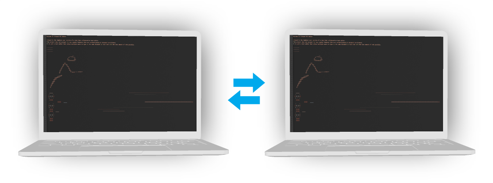

# Litepad Editor

The smallest-ever realtime collaborative editor implementation in Node.JS.

Litepad editor is the most minimalist implementation of a real-time collaborative editor. Litepad uses Socket.io to share every keystroke with all connected users.

Read the article at my [blog article](https://www.adelriosantiago.com/blog/litepad-minimal-rtc).

# Getting started

1.- Clone the project

2.- Do `npm start`

3.- Load localhost:4000

# Tests

1.- Install dependencies with `npm install`

2.- Install Playwright Chromium browser with `npx playwright install chromium`

3.- Run tests with `npm run test:e2e`

# License

MIT
